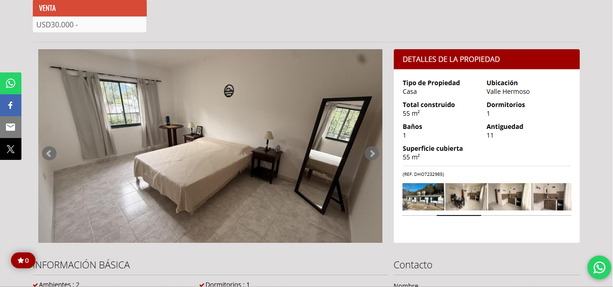
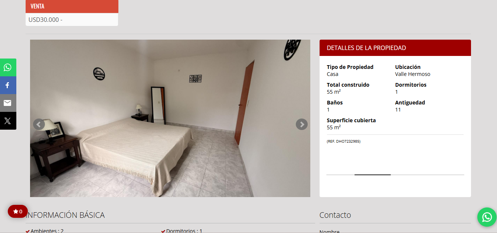
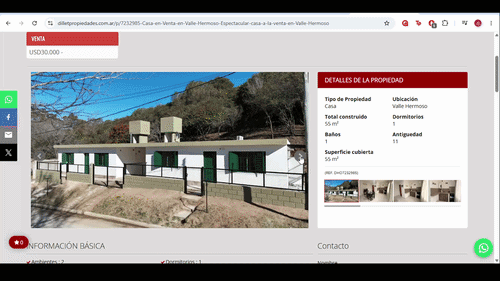

# Slider Instability During Rapid Image Navigation

## Summary

The property image slider becomes unstable after repeated rapid navigation using the next image control.

Continuous interaction with the slider eventually causes the image gallery behavior to break or become visually inconsistent.

---

## Environment

* Website: [Property Website]
* Browser: Google Chrome
* OS: Windows 11
* Resolution: 1366x768

---

## Steps to Reproduce

1. Open a property listing
2. Locate the property image slider/gallery
3. Repeatedly click the "next image" button rapidly
4. Continue interacting with the slider for several seconds
5. Observe the slider behavior

---

## Expected Result

The image slider should continue functioning normally regardless of interaction speed.

---

## Actual Result

After repeated rapid interaction, the slider becomes unstable and image behavior becomes inconsistent.

---

## Severity

Medium - UI Stability Issue

---

## Evidence

### Screenshots

---

### Reproduction GIF

---

## Notes

The issue appears to be related to rapid state changes during continuous slider interaction.

Possible causes may include:

* Animation queue conflicts
* Rendering synchronization issue
* Slider state desynchronization
* Event handling instability
