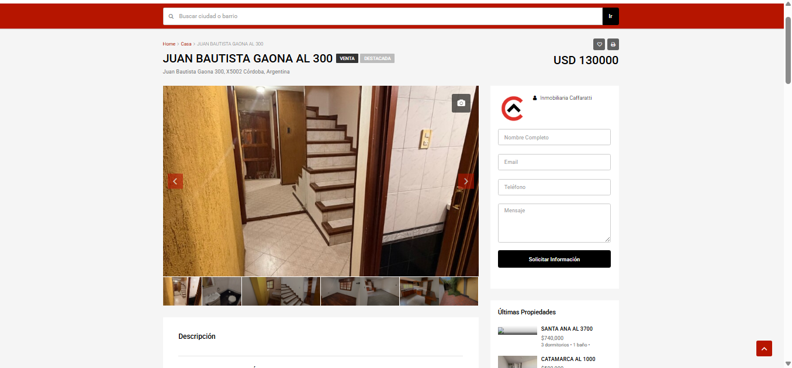
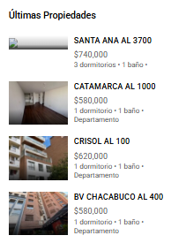
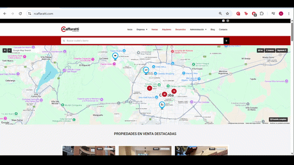

# Broken Thumbnail Rendering in Related Properties Sidebar

## Summary

A broken or unloaded thumbnail image is displayed in the "Últimas Propiedades" sidebar section when opening a property page.

The first property thumbnail appears corrupted or fails to render correctly, while the remaining thumbnails load normally.

---

## Environment

* Website: https://www.rcaffaratti.com/
* Browser: Google Chrome
* OS: Windows 10
* Resolution: 1366x768

---

## Steps to Reproduce

1. Open the website homepage
2. Enter any property listing
3. Locate the "Últimas Propiedades" section on the right sidebar
4. Observe the first property thumbnail

---

## Expected Result

All property thumbnails should render correctly.

---

## Actual Result

The first property thumbnail appears broken or unloaded while the remaining thumbnails display normally.

---

## Severity

Low - Visual/UI Issue

---

## Evidence

### Screenshot

---

### Reproduction GIF

---

## Notes

The issue appears to affect only the first thumbnail displayed in the sidebar property list.

Possible causes may include:

* Failed image request
* Incorrect thumbnail mapping
* Rendering/lazy loading issue
* Corrupted image source
